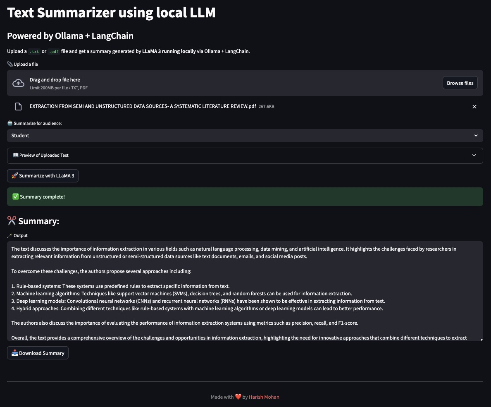

# 📄Text Summarizer using Local LLM

A lightweight, local-first application that summarizes `.txt` or `.pdf` files using **Meta’s LLaMA 3 model** running through **Ollama**, orchestrated via **LangChain**, and wrapped in an elegant **Streamlit UI**.

This app runs entirely on your machine — no API keys required, no cloud dependencies.

---

## 🚀 Features

-   ✅ Upload `.txt` or `.pdf` files.
-   🧠 Summarize with **LLaMA 3** running locally via `ollama`.
-   🗂️ View full raw content inside an expandable preview.
-   ✍️ Output summaries styled for different audiences: `Professor`, `Student`, `Novice`.
-   💾 Download summaries as `.txt` files.
-   ⚡ Runs offline after the LLaMA 3 model is pulled.

---

## 🖥️ Demo Screenshot



---

## 🛠️ Tech Stack

| Component    | Usage                                  |
| :----------- | :------------------------------------- |
| 🦙 Ollama     | Runs the LLaMA 3 model locally.        |
| 🧩 LangChain  | Handles prompt management and chaining. |
| 🧪 Streamlit  | Provides the UI for uploading & interaction. |
| 📄 pdfplumber | Extracts text from PDF files.          |
| 🐍 Python     | The base programming language.         |

---

## 📦 Installation

Follow these steps to get the LLaMA 3 Text Summarizer up and running on your machine.

### 1. Clone the repository

```bash
git clone [https://github.com/Harish9215/AI_Summary.git](https://github.com/Harish9215/AI_Summary.git)
cd AI_Summary
````

### 2\. Set up a virtual environment

It's recommended to use a virtual environment to manage dependencies.

```bash
python3 -m venv venv
source venv/bin/activate  # On Windows: `venv\Scripts\activate`
```

### 3\. Install dependencies

Install the required Python libraries using pip.

```bash
pip install -r requirements.txt
```

### 4\. Run Ollama & pull LLaMA model

You'll need to have Ollama installed on your system. If you don't have it, follow the instructions on the [Ollama website](https://ollama.com/download).

Once Ollama is installed, pull the LLaMA 3 model:

```bash
ollama pull llama3
ollama serve # This command is optional; Ollama typically runs in the background.
```

-----

## ▶️ Run the App

After completing the installation steps, launch the Streamlit app:

```bash
streamlit run app.py
```

-----

## 📁 Project Structure

```
AI_Summary/
├── app.py              # Streamlit frontend for the UI
├── summary.py          # LangChain prompt and summarization logic
├── requirements.txt    # Python dependencies for the project
├── .gitignore          # Specifies intentionally untracked files to ignore
├── README.md           # This README file
└── screenshots/        # (Optional) Folder for app screenshots
```

-----

## 👤 Audience Modes

The app allows you to tailor the summary's style for different audiences:

  * **Professor**: Technical and formal, suitable for academic or expert audiences.
  * **Student**: Academic but accessible, ideal for college or university students.
  * **Novice**: Simple, friendly, and jargon-free, perfect for beginners or general audiences.

-----

## 📌 Example Use Cases

  * 📚 Summarize research papers quickly.
  * 📝 Create concise executive summaries of lengthy documents.
  * 📄 Convert raw notes into readable, organized insights.
  * 🧑‍🏫 Explain complex technical PDFs to beginners in an understandable way.

-----

## 🧠 LLaMA 3 Model

The core of this application is Meta's LLaMA 3 model. It runs entirely locally through Ollama, ensuring no API keys are required and your data remains private. By default, it uses the LLaMA 3 8B model, though it can be configured for the 3.2B version if preferred.

-----

## 🙌 Acknowledgments

Special thanks to:

  * **Meta AI** for developing the powerful LLaMA 3 model.
  * **LangChain** for simplifying model orchestration and prompt management.
  * **Ollama** for making local LLM inference incredibly easy.
  * **Streamlit** for enabling the creation of beautiful, interactive web apps with Python.

-----

## ✨ Author

Made with ❤️ by [Harish Mohan](https://www.google.com/search?q=https://github.com/Harish9215)

```
```